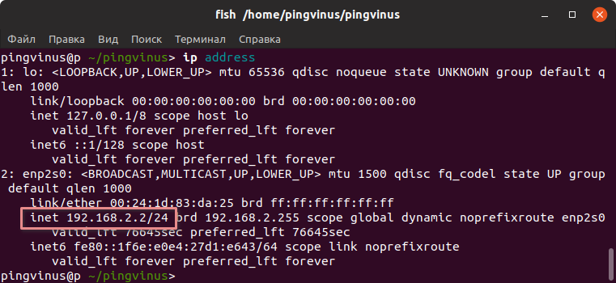

# Примечание
**Система должна развертываться под системой Linux используя дистрибутив Ubuntu 20.04 и развертыванием должен заниматься человек с базовым пониманием Linux**


# Оглавление
1. [Запуск](#запуск-проекта-с-помощью-скрипта)
2. [Отстановка системы](#отключение-системы)


# Запуск проекта с помощью скрипта
Перед выполнение действий ниже вам необходимо выполнить следующие условия:

 - запустить команду `sudo apt-get install git -y`

## Подгрузка репозитория
Перед запуском проекта его необходимо клонировать из удаленного репозитория сделать это можно следующим образом

> Не забудьте создать папку в которой будет лежать проект к примеру, это может быть  
```sh
mkdir ~/projects
```
Перейдите в папку 
```sh
cd ~/projects
```
После склонируйте репозиторий следующей командой:
```sh
git clone http://gitlab.askills.ru/team7/team7.git
```

Если загрузка git репозитория зависла повторите ее заново в случае если не удается выполнить клонирование, разархивируйте папку с проектом в папку `~/projects/team7/`

После загрузки структура должна выглядить таким образом 
```
-projects
----team7
    ----docs
    ----install
    ----presentaion
    ----sources
```

## Настройка окружения

### Серверная часть
В папке `~/projects/team7/install/backend` вам надо создать или обновить .env файл. В нем должна содержать переменная следущего вида:
```sh
MONGODB_URI="mongodb://mongo:27017"
```

### Клиентская часть
В папке `~/projects/team7/install/frontend/src `вам надо обновить const.js файл. В нем должна содержаться экспортируемая переменная следущего вида:
```js
export const SERVER_URL = 'http://{{ адрес_вашей_машины }}:8082'
```

### Инструментальная часть
В папке `~/projects/team7/install/tools` вам надо создать или обновить .env файл. В нем должна содержать переменная следущего вида:
```sh
MONGODB_URI="mongodb://localhost:27017"
PRODUCTION="true"
```

> Адрес машины можно узнать таким [способом](#как-узнать-ip-машины)

## Загрузка исходных данных
 - Для того что бы загрузить исходные данные вам необходимо положить их в папку `~/projects/team7/install/tools/data`
 > В исходных материалах для картинок и видео допускаются только файлы типа .jpg, .png, .jpeg, .webm и видео формата .mp4

## Запуск дистрибутива
 - перейти в директорию `~/projects/team7/install/deploy`, это можно сделать используя команду `cd ~/projects/team7/install/deploy`.

Для того что бы запустить проект вам необходимо выполнить следующие действия:
- Выдать права файлу `sudo chmod +x deploy.sh`

- запутить команду `./deploy.sh` который находится в папке deploy (В случае запроса соглашений, принимайте их)

- Дождитесь загрузки, после немного подождите пока произойдет установка зависимостей.

- находясь в директории `~/projects/team7/install/tools` запустите команду `./tools data upload`

 В случае успешного запуска, перейдите на `http://{{адрес_вашей_машины}}:8080`.

 В случае если после запуска у вас нету данных или сайт отображается неверно, убедитесь что вы правильно выполнили все пункты выше.


# FAQ
## Как узнать ip машины?
Для того что бы узнать адрес вашей машины вы можете выполнить команду `ip addr`после вам выдется текст примерно такого формата


вам надо скопировать то что идет после inet и до /
> Пример: inet 172.20.7.41/24 -> 172.20.7.41
# Отключение системы
Для того что бы приостановить работу системы вам необходимо выполнить следующую команду находясь в дериктории `~/projects/team7/install/deploy`.

Если вы находитесь в не этой дериктории перейдите в нее используя команду:
```sh
cd ~/projects/team7/install/deploy
```

Команда для остановки
```sh
sudo docker compose down
```